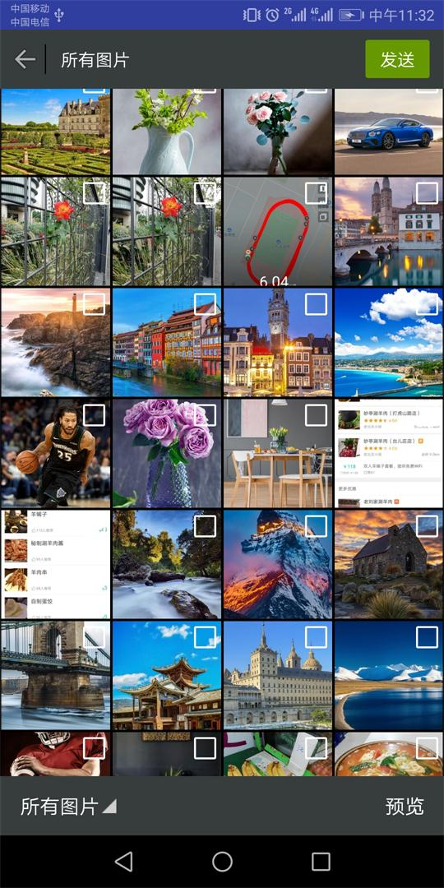

# CameraDemo

### 图片选择预览功能




### 遇到的问题
```
Could not determine the dependencies of task ':app:lintVitalRelease'.
> Could not resolve all artifacts for configuration ':app:debugCompileClasspath'.
   > Failed to transform annotation-experimental-1.4.0.aar (androidx.annotation:annotation-experimental:1.4.0) to match attributes {artifactType=android-manifest, org.gradle.category=library, org.gradle.dependency.bundling=external, org.gradle.libraryelements=aar, org.gradle.status=release, org.gradle.usage=java-api}.
      > Execution failed for JetifyTransform: /Users/dumingwei/.gradle/caches/modules-2/files-2.1/androidx.annotation/annotation-experimental/1.4.0/c7a2038d831d0cfbfb9a440890b287c2e839ecf/annotation-experimental-1.4.0.aar.
         > Failed to transform '/Users/dumingwei/.gradle/caches/modules-2/files-2.1/androidx.annotation/annotation-experimental/1.4.0/c7a2038d831d0cfbfb9a440890b287c2e839ecf/annotation-experimental-1.4.0.aar' using Jetifier. Reason: IllegalArgumentException, message: Unsupported class file major version 61. (Run with --stacktrace for more details.)
           Suggestions:
            - Check out existing issues at https://issuetracker.google.com/issues?q=componentid:460323&s=modified_time:desc, it's possible that this issue has already been filed there.
            - If this issue has not been filed, please report it at https://issuetracker.google.com/issues/new?component=460323 (run with --stacktrace and provide a stack trace if possible).

* Try:
Run with --stacktrace option to get the stack trace. Run with --info or --debug option to get more log output. Run with --scan to get full insights.


```
解决方法： 改变Jdk版本

```
Null extracted folder for artifact: ResolvedArtifact(componentIdentifier=androidx.annotation:annotation-experimental:1.4.0, variantName=null, artifactFile=/Users/dumingwei/.gradle/caches/modules-2/files-2.1/androidx.annotation/annotation-experimental/1.4.0/c7a2038d831d0cfbfb9a440890b287c2e839ecf/annotation-experimental-1.4.0.aar, extractedFolder=null, dependencyType=ANDROID, isWrappedModule=false, buildMapping={__current_build__=/Users/dumingwei/OLD_AS_Project/CameraDemo}, mavenCoordinatesCache=com.android.build.gradle.internal.ide.dependencies.MavenCoordinatesCacheBuildService$Inject@59dc0111)
```
原因是因为，去掉下面这一行就可以了
```
implementation 'androidx.core:core-ktx:+'
```

### 关于分区存储

### 参考链接
[ioneday/ImageSelector](https://github.com/ioneday/ImageSelector)

[jeasonlzy/ImagePicker](https://github.com/jeasonlzy/ImagePicker)
